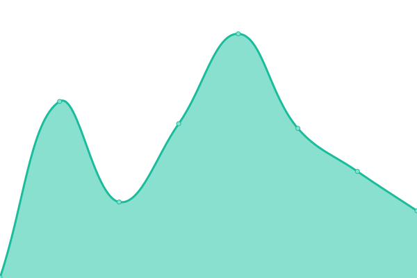
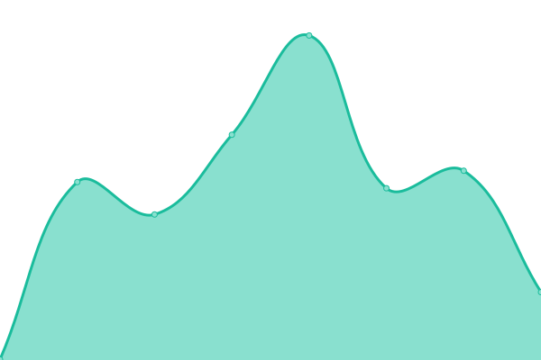

# [📈 Live Status](https://status.battlefield.agency): <!--live status--> **🟩 All systems operational**

This repository contains the open-source uptime monitor and status page for [neutr0nst4r](https://status.battlefield.agency), powered by [Upptime](https://github.com/upptime/upptime).

With [Upptime](https://upptime.js.org), you can get your own unlimited and free uptime monitor and status page, powered entirely by a GitHub repository. We use [Issues](https://github.com/neutr0nst4r/battlefieldagency-uptime/issues) as incident reports, [Actions](https://github.com/neutr0nst4r/battlefieldagency-uptime/actions) as uptime monitors, and [Pages](https://status.battlefield.agency) for the status page.

<!--start: status pages-->
<!-- This summary is generated by Upptime (https://github.com/upptime/upptime) -->
<!-- Do not edit this manually, your changes will be overwritten -->
<!-- prettier-ignore -->
| URL | Status | History | Response Time | Uptime |
| --- | ------ | ------- | ------------- | ------ |
|  [Website](https://battlefield.agency) | 🟩 Up | [website.yml](https://github.com/neutr0nst4r/battlefieldagency-uptime/commits/HEAD/history/website.yml) | 

 94ms
     
 | 

<a href="https://status.battlefield.agency/history/website">100.00%</a>
    

|  Web API | 🟩 Up | [web-api.yml](https://github.com/neutr0nst4r/battlefieldagency-uptime/commits/HEAD/history/web-api.yml) | 

 370ms
     
 | 

<a href="https://status.battlefield.agency/history/web-api">100.00%</a>
    

|  Plugin API | 🟩 Up | [plugin-api.yml](https://github.com/neutr0nst4r/battlefieldagency-uptime/commits/HEAD/history/plugin-api.yml) | 

 425ms
     
 | 

<a href="https://status.battlefield.agency/history/plugin-api">100.00%</a>
    

|  Internal systems monitoring | 🟩 Up | [internal-systems-monitoring.yml](https://github.com/neutr0nst4r/battlefieldagency-uptime/commits/HEAD/history/internal-systems-monitoring.yml) | 

 860ms
     
 | 

<a href="https://status.battlefield.agency/history/internal-systems-monitoring">100.00%</a>
    

<!--end: status pages-->

[**Visit our status website →**](https://status.battlefield.agency)

## 📄 License

- Powered by: [Upptime](https://github.com/upptime/upptime)
- Code: [MIT](./LICENSE) © [neutr0nst4r](https://status.battlefield.agency)
- Data in the `./history` directory: [Open Database License](https://opendatacommons.org/licenses/odbl/1-0/)
